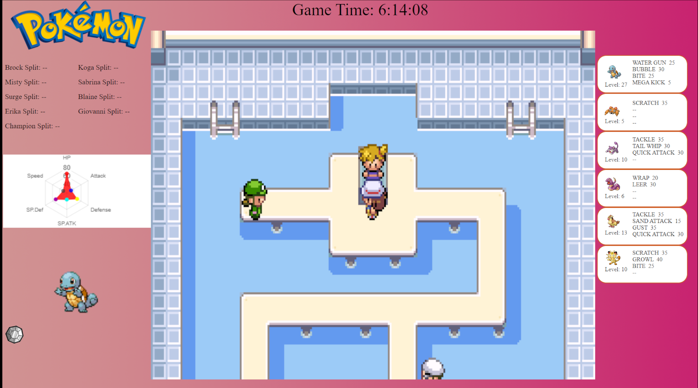
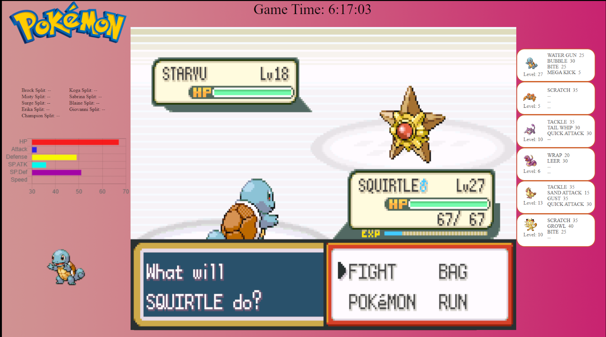

# OpenSourceGamehookUI
Currently in public alpha version. Please test and report any issues you find.
Used for Pokemon Generation 1 through 3. Designed to update the UI according to which version of pokemon you are running (official versions only at this time). Will show how long in gametime it took for you to beat each gym and the champion. Also showcases the full party you are using and their abilities. Will also show live stats of the currently selected pokemon in radar chart for over world and horizontal bar chart in battle.

Over world example:

Battle example:

