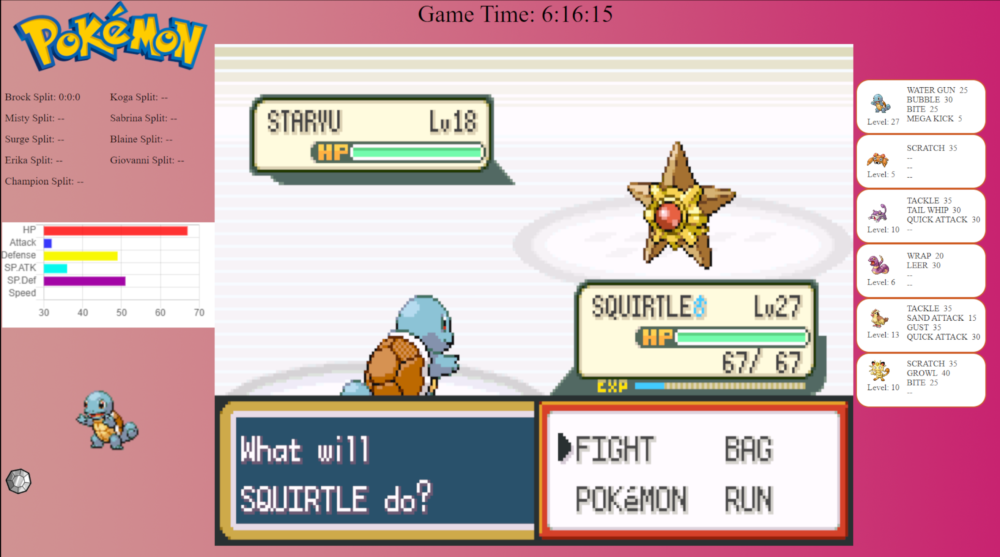

# OpenSourceGamehookUI
<b>Currently in public alpha version. Please test and report any issues you find.</b> 
Used for Pokemon Generation 1 through 3. Designed to update the UI according to which version of pokemon you are running (official versions only at this time). Will show how long in gametime it took for you to beat each gym and the champion. Also showcases the full party you are using and their abilities. Will also show live stats of the currently selected pokemon in radar chart for over world and horizontal bar chart in battle.
 
 
<b>How does it work?</b>
 
Create a browser source in OBS or any streaming software you are using that supports the feature (XSplit will not natively work, will need to have the index.html open in a web browser and do window capture). Select the Local File option and the local file should be the index.html file wherever you have stored it on your system. Have RetroArch open with the pokemon game you want to play running, open Gamehook and select the appropriate mapper file. From there, the data will display as the information becomes available.
If you are using the UI in a browser window. Make sure to have RetroArch running the rom you want to play, gamehook with the selected mapper for the game active first. Then load the index.html file. Otherwise, you will need to refresh the page to get data loaded in from gamehook.
 
 
<b>Are there any issues?</b>
 
If you save and exit from the game and close OBS, if you were to restart the game, obs and gamehook, it will display the information that loads when the game has loaded, but the splits data will not be populated. This is because the data is not stored on disc, local storage on the browser or in any sort of database.
 
There is a chance that splits data will not be stored in the same location. This is due to how the data from the rom is passed around, a fix will be implemented once a proper solution has been found to avoid this. This is especially true with Generation 2 as the Johoto and Kanto gym badges share the same ram address values.
 
 
Over world example:

Battle example:

